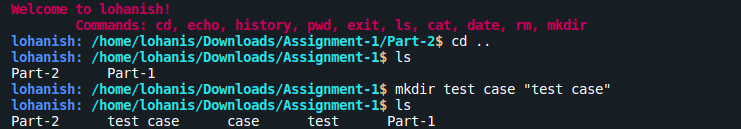
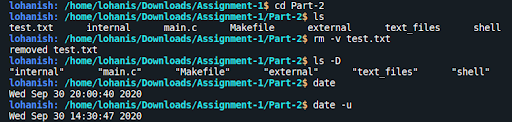
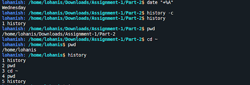
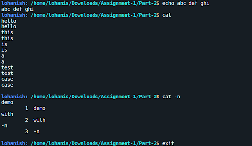

<div align="center">
  
  <h1>Lohanish</h1>
</div>

## Overview

A Linux shell coded in C, consisting of 10 commands with 2 options each and accepting all possible arguments. Coded both internal and external commands, using `fork()` and `exec()` system calls respectively. Also handled various corner cases and errors.

## Instructions

Run the following commands on the terminal

```
git clone https://github.com/ananyalohani/lohanish.git
cd lohanish
make
./shell
```

For the full details of implementation, check out [`documentation.pdf`](https://github.com/ananyalohani/lohanish/blob/master/documentation.pdf).

## Commands

#### Internal

- **`cd`**: `-P`, `--help`

- **`echo`**: `-n`, `-E`

- **`history`**: `-c`, `-d`

- **`pwd`**: `-P`, `--help`

- **`exit`**

#### External

- **`ls`**: `-m`, `-D`

- **`cat`**: `-n`, `-E`

- **`date`**: `-u`, `-R`

- **`rm`**: `-v`, `-i`

- **`mkdir`**: `-v`, `-p`

## Demo









#### Made By

**[Ananya Lohani](https://ananyalohani.me/)** | [GitHub](https://github.com/ananyalohani/)
